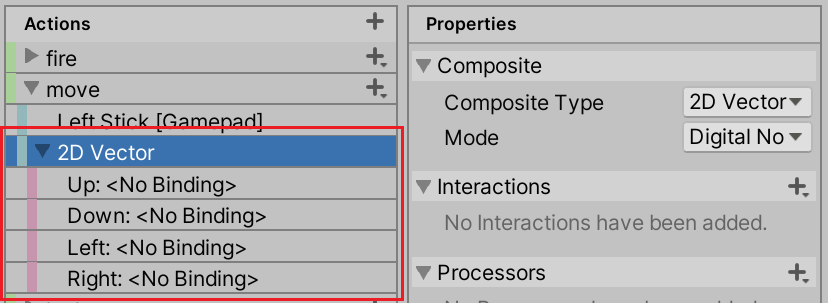
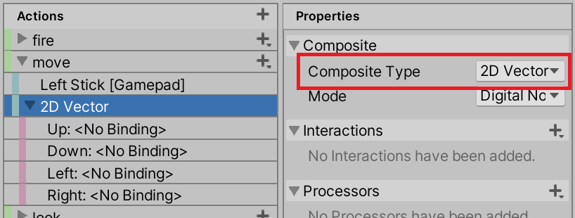
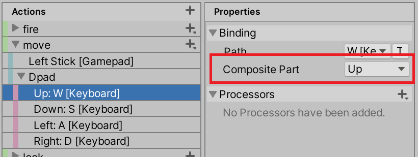
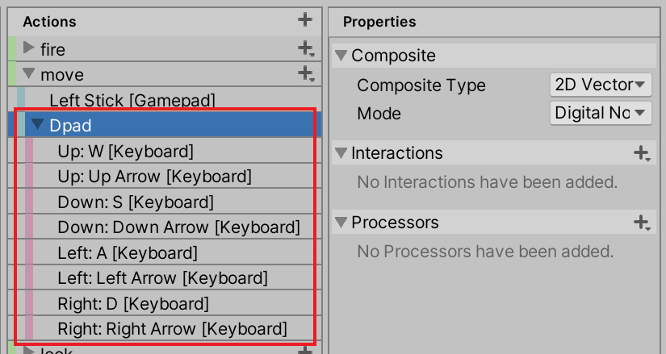

# Input Action Assets

* [Creating Action Assets](#creating-input-action-assets)
* [Editing Action Assets](#editing-input-action-assets)
* [Using Action Assets](#using-input-action-assets)

An Input Action Asset is an Asset which contains [Input Actions](Actions.md) and their associated [Bindings](ActionBindings.md) and [Control Schemes](ActionBindings.md#control-schemes). These Assets have the `.inputactions` file extension and are stored in a plain JSON format.

## Creating Input Action Assets

To create an Asset that contains [Input Actions](Actions.md) in Unity, right-click in the __Project__ window or go to __Assets > Create > Input Actions__ from Unity's main menu.

## Editing Input Action Assets

To bring up the Action editor, double-click an `.inputactions` Asset in the Project Browser, or select the __Edit Asset__ button in the Inspector for that Asset. You can have more than one editor window open at the same time, but not for the same Asset.


The Action editor appears as a separate window, which you can also dock into Unity's main UI.

>__Note__: For details about how Action Maps, Actions, and Bindings work, see documentation on [Actions](Actions.md).

By default, Unity doesn't save edits you make in the Action Asset window when you save the Project. To save your changes, select __Save Asset__ in the window's toolbar. To discard your changes, close the window and choose __Don't Save__ when prompted. Alternatively, you can toggle auto-saving on by enabling the __Auto-Save__ checkbox in the toolbar. This saves any changes to that Asset.

>__Note__: This setting affects all `.inputactions` Assets, and persists across Unity Editor sessions.

The Action editor window is divided into three panes:

1. The left pane lists the Action Maps in the Asset. Each Action Map is a collection of Actions that you can enable or disable in bulk.
2. The middle pane contains the Actions in the currently selected Action Map, and the bindings associated with each Action.
3. The right pane contains the properties of the currently selected Action or Binding.

Use the following keyboard shortcuts to quickly trigger common operations:

|Shortcut (Mac)|Shortcut (Windows)|Description|
|--------------|------------------|-----------|
|⌘X, ⌘C, ⌘V|Ctrl-X, Ctrl-C, Ctrl-V|Cut, Copy, and Paste. Can be used on Actions, Action Maps, and Bindings.|
|⌘D|Ctrl-D|Duplicate. Can be used on Actions, Action Maps, and Bindings.|
|⌘⌫|Del|Delete. Can be used on Actions, Action Maps, and Bindings.|
|⌥S|Alt-S|Save.|
|⌥M|Alt-M|Add Action Map.|
|⌥A|Alt-A|Add Action.|
|⌥B|Alt-B|Add Binding.|


>__Tip__: You can search for Devices and/or Control Schemes directly from the search box. For example, "d:gamepad" filters for bindings to gamepad Devices, whereas "g:gamepad" filters for bindings in the "gamepad" Control Scheme. Matching is case-insensitive and matches any partial name.

### Editing Action Maps


* To add a new Action Map, select the Add (+) icon in the header of the Action Map column.
* To rename an existing Action Map, either long-click the name, or right-click the Action Map and select __Rename__ from the context menu. Note that Action Map names can't contain slashes  (`/`).
* To delete an existing Action Map, either right-click it and select __Delete__ from the context menu, or use the Delete key (Windows) / ⌘⌫ (Mac).
* To duplicate an existing Action Map, either right-click it and select __Duplicate__ from the context menu, or use Ctrl-D (Windows) / ⌘D (Mac).

### Editing Actions


* To add a new Action, select the Add (+) icon in the header of the Action column.
* To rename an existing Action, either long-click the name, or right-click the Action Map and select __Rename__ from the context menu.
* To delete an existing Action, either right-click it and select __Delete__ from the context menu, or use the Delete key (Windows) / ⌘⌫ (Mac).
* To duplicate an existing Action, either right-click it and select __Duplicate__ from the context menu, or use Ctrl-D (Windows) / ⌘D (Mac).

If you select an Action, you can edit it's properties in the right-hand pane of the window:


### Editing Bindings

* To add a new Binding, select the Add (+) icon on the action you want to add it to, and select the binding type from the menu that appears.
* To delete an existing Binding, either right-click it and select __Delete__ from the context menu, or use the Delete key (Windows) / ⌘⌫ (Mac).
* To duplicate an existing Binding, either right-click it and select __Duplicate__ from the context menu, or use Ctrl-D (Windows) / ⌘D (Mac).

If you select a Binding, you can edit its properties in the right-hand pane of the window:


#### Picking Controls

The most important property of any Binding is the [control path](Controls.md#control-paths) it's bound to. To edit it, open the __Path__ drop-down list. This displays a Control picker window.


In the Control picker window, you can explore a tree of Input Devices and Controls that the Input System recognizes, and bind to these Controls. Unity filters this list by the Action's [`Control Type`](../api/UnityEngine.InputSystem.InputAction.html#UnityEngine_InputSystem_InputAction_expectedControlType) property. For example, if the Control type is `Vector2`, you can only select a Control that generates two-dimensional values, like a stick.

The Device and Control tree is organized hierarchically from generic to specific. For example, the __Gamepad__ Control path `<Gamepad>/buttonSouth` matches the lower action button on any gamepad. Alternatively, if you navigate to __Gamepad__ > __More Specific Gamepads__ and select __PS4 Controller__, and then choose the Control path `<DualShockGamepad>/buttonSouth`, this only matches the "Cross" button on PlayStation gamepads, and doesn't match any other gamepads.

Instead of browsing the tree to find the Control you want, it's easier to let the Input System listen for input. To do that, select the __Listen__ button. At first, the list of Controls is empty. Once you start pressing buttons or actuating Controls on the Devices you want to bind to, the Control picker window starts listing any Bindings that match the controls you pressed. Select any of these Bindings to view them.

Finally, you can choose to manually edit the Binding path, instead of using the Control picker. To do that, select the __T__ button next to the Control path popup. This changes the popup to a text field, where you can enter any Binding string. This also allows you to use wildcard (`*`) characters in your Bindings. For example, you can use a Binding path such as `<Touchscreen>/touch*/press` to bind to any finger being pressed on the touchscreen, instead of manually binding to `<Touchscreen>/touch0/press`, `<Touchscreen>/touch1/press` and so on.

#### Editing Composite Bindings

Composite Bindings are Bindings consisting of multiple parts, which form a Control together. For instance, a [2D Vector Composite](ActionBindings.md#2d-vector) uses four buttons (left, right, up, down) to simulate a 2D stick input. See the [Composite Bindings](ActionBindings.md#composite-bindings) documentation to learn more.



To create a Composite Binding, in the Input Action Asset editor window, select the Add (+) icon on the Action you want to add it to, and select the Composite Binding type from the popup menu.

>__Important__: The set of Composites displayed in the menu is filtered based on the value type of the Action. This means that, for example, if the Action is set to type "Button", then only Composites able of returning values of type `float` will be shown.


This creates multiple Binding entries for the Action: one for the Composite as a whole, and then, one level below that, one for each Composite part. The Composite itself doesn't have a Binding path property, but its individual parts do, and you can edit these parts like any other Binding. Once you bind all the Composite's parts, the Composite can work together as if you bound a single control to the Action.

To change the type of a Composite retroactively, select the Composite, then select the new type from the **Composite Type** drop-down in the **Properties** pane.



To can change the part of the Composite to which a particular Binding is assigned, use the **Composite Part** drop-down in the Binding's properties.



Multiple Bindings can be assigned to the same part. You can also duplicate individual part Bindings: right-click the Binding, then select **Duplicate** to create new part Bindings for the Composite. This can be used, for example, to create a single Composite for both "WASD" style controls and arrow keys.



### Editing Control Schemes

Input Action Assets can have multiple [Control Schemes](ActionBindings.md#control-schemes), which let you enable or disable different sets of Bindings for your Actions for different types of Devices.


To see the Control Schemes in the Input Action Asset editor window, open the Control Scheme drop-down list in the top left of the window. This menu lets you add or remove Control Schemes to your Asset. If the Asset contains any Control Schemes, you can select a Control Scheme, and then the window only shows bindings that belong to that Scheme. If you select a binding, you can now pick the Control Schemes for which this binding should be active in the __Properties__ view to the left of the window. When you add a new Control Scheme, or select an existing Control Scheme, and then select __Edit Control Scheme…__, you can edit the name of the Control Scheme and which devices the Scheme should be active for.

## Using Input Action Assets

### Auto-generating script code for Actions

One of the most convenient ways to work with `.inputactions` Assets in scripts is to automatically generate a C# wrapper class for them. This removes the need to manually look up Actions and Action Maps using their names, and also provides an easier way to set up callbacks.

To enable this option, tick the __Generate C# Class__ checkbox in the importer properties in the Inspector of the `.inputactions` Asset, then select __Apply__.


You can optionally choose a path name, class name, and namespace for the generated script, or keep the default values.

This generates a C# script that simplifies working with the Asset.

```CSharp
using UnityEngine;
using UnityEngine.InputSystem;

// IGameplayActions is an interface generated from the "gameplay" action map
// we added (note that if you called the action map differently, the name of
// the interface will be different). This was triggered by the "Generate Interfaces"
// checkbox.
public class MyPlayerScript : MonoBehaviour, IGameplayActions
{
    // MyPlayerControls is the C# class that Unity generated.
    // It encapsulates the data from the .inputactions asset we created
    // and automatically looks up all the maps and actions for us.
    MyPlayerControls controls;

    public void OnEnable()
    {
        if (controls == null)
        {
            controls = new MyPlayerControls();
            // Tell the "gameplay" action map that we want to get told about
            // when actions get triggered.
            controls.gameplay.SetCallbacks(this);
        }
        controls.gameplay.Enable();
    }

    public void OnDisable()
    {
        controls.gameplay.Disable();
    }

    public void OnUse(InputAction.CallbackContext context)
    {
        // 'Use' code here.
    }

    public void OnMove(InputAction.CallbackContext context)
    {
        // 'Move' code here.
    }

}
```

### Using Action Assets with `PlayerInput`

The [`PlayerInput`](Components.md#playerinput-component) component provides a convenient way to handle input for one or multiple players. It requires you to set up all your Actions in an Input Action Asset, which you can then assign to the [`PlayerInput`](Components.md#playerinput-component) component. [`PlayerInput`](Components.md#playerinput-component) can then automatically handle activating Action Maps and selecting Control Schemes for you. To learn more, see the documentation on [GameObject Components for Input](Components.md).


### Modifying Input Action Assets at runtime
There are several ways to modify an Input Action Asset at runtime. Any modifications that you make during Play mode to an Input Action Asset do not persist in the Input Action Asset after you exit Play mode. This means you can test your application in a realistic manner in the Editor without having to worry about inadvertently modifying the asset. For examples on how to modify an Input Action Asset, see the documentation on [Creating Actions in code](Actions.md#creating-actions-in-code) and [Changing Bindings](ActionBindings.md#changing-bindings).
